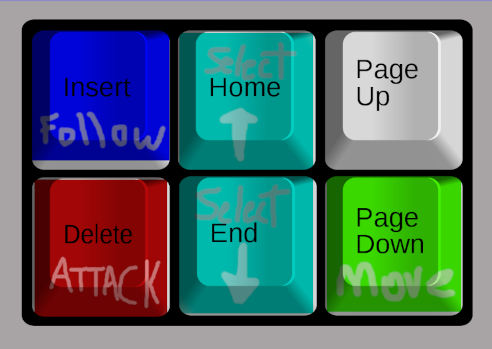

# WHAT'S NEW

### ⭐ Gameplay

 - __First Person Command__ - You may now issue commands to your squadrons while in the FPS mode. Squadrons must be created in RTS mode first. You can issue: _Move To_, _Follow Self/Other_, and _Attack_.
 - 

### ⭐ Controls

- __Mouse Wheel Zooming__. - You can now control the zoom with the mouse wheel for faster zooming like in more modern RTSes. 

### ⭐ Graphics

- Anti-aliasing. It makes a difference.
- Full Screen Cinematics.  Just like the old days (:

### ⭐ Miscellaneous

- No more crashing on Linux! Case insensitivity for asset file lookup.
- Enable/disable music from config.xml with: `<key name="Options\Music\enabled">0</key>` (Enabled by default)
